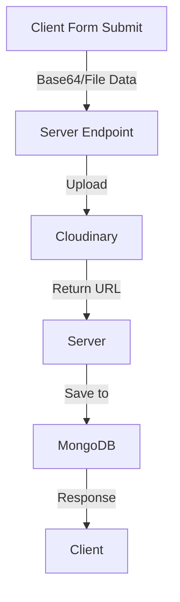
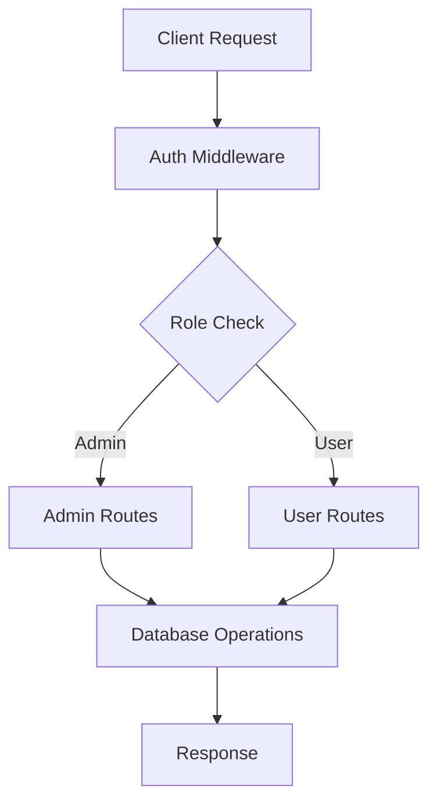

<div align="center">
  <h1>🚀 MERN Stack Admin Dashboard</h1>
  <p>A full-featured, modern admin dashboard with advanced image handling and role-based authentication</p>
  
  [](https://choosealicense.com/licenses/mit/)
  [](https://nodejs.org/)
  [](https://reactjs.org/)
  [](https://www.mongodb.com/)
</div>

---

## 📚 Table of Contents

- [Overview](#-overview)
- [Demo / Documentation](#-demo)
- [Tech Stack](#-tech-stack)
- [Features](#-features)
- [Installation](#-installation)
- [Environment Setup](#-environment-setup)
- [Project Structure](#-project-structure)
- [API Documentation](#api-routes-documentation)
- [Database Models](#database-models)
- [Image Handling](#-image-handling-implementation)
- [Security](#-security-implementation)
- [Error Handling](#error-handling)
- [Workflow](#-workflow)
- [References](#-references)
- [Contributing](#-contributing)
- [Version History](#-version-history)
- [License](#-license)
- [Acknowledgements](#-acknowledgements)

## 🌟 Overview
A full-featured admin dashboard with advanced image handling, role-based authentication, and comprehensive data management.

## 🎥 Demo

### Video Demonstration / Documentation
[Watch the full demo video or Documentation](https://drive.google.com/file/d/1UfLEgLu6KzTAP_Yhg3WdYbY9FIKfeYUL/view?usp=drive_link)

### Key Features Demonstrated:
- User Authentication & Authorization
- Admin Dashboard Operations
- Image Upload & Management
- Service Management
- User Management
- Contact Form Handling

## 🛠 Tech Stack

<details>
<summary>Frontend Technologies</summary>

| Technology | Version | Purpose |
|------------|---------|----------|
| React.js | 18.x | UI Framework |
| Vite | 4.x | Build Tool |
| TailwindCSS | 3.x | Styling |
| React Router | 6.x | Routing |
| React Icons | 4.x | UI Icons |
| Swiper.js | 9.x | Carousels |
| React Toastify | 9.x | Notifications |

</details>

<details>
<summary>Backend Technologies</summary>

| Technology | Version | Purpose |
|------------|---------|----------|
| Node.js | 18.x | Runtime |
| Express.js | 4.x | Web Framework |
| MongoDB | 6.x | Database |
| Mongoose | 7.x | ODM |
| JWT | 9.x | Authentication |
| Bcrypt | 5.x | Password Hashing |
| Cloudinary | 1.x | Image Storage |

</details>

## ⭐ Features

<details>
<summary>Authentication System</summary>

```javascript
// User Authentication Flow
1. JWT-based authentication
2. Role-based access (Admin/Moderator/User)
3. Password hashing with bcrypt
4. Token validation middleware
5. Protected routes
```
</details>

### Authentication & Authorization
- Multi-role user system (Admin/Moderator/User)
- JWT-based session management
- Secure password hashing
- Protected routes

### Admin Features
- Dashboard with statistics
- User management (CRUD)
- Service management
- Contact form submissions
- File management
- Query handling

### User Features
- Profile management
- File uploads
- Service browsing
- Contact submission
- Security settings

## 🔧 Environment Setup

### Frontend (.env)
```env
VITE_BASE_URL=http://localhost:5000/api/
VITE_CLOUD_NAME=your_cloudinary_cloud_name
VITE_UPLOAD_PRESET=your_upload_preset
VITE_API_KEY=your_cloudinary_api_key
```

### Backend (.env)
```env
PORT=5000
MONGODB_URI=mongodb+srv://your_connection_string
JWT_SECRET=your_jwt_secret
SALT_ROUNDS=10
CLOUD_NAME=your_cloudinary_name
API_KEY=your_cloudinary_api_key
API_SECRET=your_cloudinary_api_secret
MAX_FILE_SIZE=5242880
ALLOWED_FILE_TYPES=jpeg,jpg,png,gif
```

## 📦 Installation

```bash
# Clone repository
git clone https://github.com/MianAlikhalid/MERN-Stack-project.git

# Install dependencies
npm run setup

# Start development servers
npm run dev
```

## 📁 Project Structure
```
project/
├── client/
│   ├── src/
│   │   ├── components/
│   │   │   ├── Layouts/
│   │   │   │   ├── components/
│   │   │   │   │   ├── AdminSidebar.jsx
│   │   │   │   │   ├── QueryApprove.jsx
│   │   │   │   │   └── QueryPending.jsx
│   │   │   │   └── Pages/
│   │   │   │       ├── Admin-AddService.jsx
│   │   │   │       ├── Admin-AddUsers.jsx
│   │   │   │       ├── Admin-ContactView.jsx
│   │   │   │       ├── Admin-Contacts.jsx
│   │   │   │       ├── Admin-Queries.jsx
│   │   │   │       ├── Admin-ServiceUpdate.jsx
│   │   │   │       ├── Admin-Services.jsx
│   │   │   │       ├── Admin-Update.jsx
│   │   │   │       └── Admin-Users.jsx
│   │   │   └── Navbar.jsx
│   │   ├── pages/
│   │   │   ├── About.jsx
│   │   │   ├── Contact.jsx
│   │   │   ├── Home.jsx
│   │   │   ├── Login.jsx
│   │   │   ├── Profile.jsx
│   │   │   ├── Security.jsx
│   │   │   ├── Services.jsx
│   │   │   └── SingleService.jsx
│   │   ├── store/
│   │   │   └── Auth.jsx
│   │   └── App.jsx
├── server/
│   ├── Controllers/
│   │   ├── admin-controller.js
│   │   ├── auth-controller.js
│   │   └── service-controller.js
│   ├── Models/
│   │   ├── contact-model.js
│   │   ├── image-model.js
│   │   ├── service-model.js
│   │   └── user-model.js
│   ├── Routes/
│   │   ├── admin-router.js
│   │   ├── auth-router.js
│   │   └── service-route.js
│   ├── Middleware/
│   │   ├── auth-middleware.js
│   │   ├── error-middleware.js
│   │   └── validate-middleware.js
│   └── server.js
```

## API Routes Documentation

### Authentication Routes
```
POST /api/auth/register       - Register new user
POST /api/auth/login         - User login
GET /api/auth/logout         - User logout
GET /api/auth/user          - Get user profile
PATCH /api/auth/update-password - Update password
PATCH /api/auth/update-email    - Update email
PATCH /api/auth.update-phone    - Update phone
```

### Admin Routes
```
# User Management
GET /api/admin/users         - Get all users
GET /api/admin/users/:id     - Get single user
POST /api/admin/users/add    - Add new user
PATCH /api/admin/users/update/:id - Update user
DELETE /api/admin/users/delete/:id - Delete user

# Service Management
GET /api/admin/services      - Get all services
POST /api/admin/services/add - Add new service
PATCH /api/admin/services/update/:id - Update service
DELETE /api/admin/services/delete/:id - Delete service

# Contact Management
GET /api/admin/contacts      - Get all contacts
GET /api/admin/contacts/:id  - Get single contact
GET /api/admin/contacts/count - Get contacts count
```

### Service Routes
```
GET /api/services           - Get all services
GET /api/services/:id       - Get single service
POST /api/services         - Create service
PATCH /api/services/:id    - Update service
DELETE /api/services/:id   - Delete service
```

### File Routes
```
POST /api/file/upload      - Upload file
GET /api/file/files        - Get all files
DELETE /api/file/:id       - Delete file
POST /api/file/service-image - Upload service image
```

## Database Models

### User Model
- username: String (required)
- email: String (unique, required)
- password: String (required)
- phone: String
- role: String (enum: ['admin', 'moderator', 'user'])
- avatar: String
- privateNote: String

### Service Model
- name: String (required)
- description: String (required)
- price: Number
- image: String
- provider: String

### Contact Model
- name: String (required)
- email: String (required)
- message: String (required)
- phone: String
- createdAt: Date

### Image Model
```javascript
{
  firstName: String,
  lastName: String,
  email: String,
  personalDetails: String,
  city: String,
  province: String,
  country: String,
  image: {
    public_id: String,
    url: String
  },
  userId: ObjectId (ref: 'User'),
  timestamps: true
}
```

## 📸 Image Handling Implementation

### Image Upload Flow


### Frontend Implementation
```jsx
// Image Upload Component Example
const handleImageSubmit = async (formData) => {
  try {
    const response = await fetch(`${import.meta.env.VITE_BASE_URL}api/file/upload`, {
      method: 'POST',
      headers: {
        'Authorization': authorizationToken,
      },
      body: formData
    });
    
    if (!response.ok) throw new Error('Upload failed');
    
    const data = await response.json();
    return data.url; // Cloudinary URL
  } catch (error) {
    toast.error("Upload failed");
  }
};
```

### Backend Implementation
```javascript
// Cloudinary Configuration
cloudinary.config({
  cloud_name: process.env.CLOUD_NAME,
  api_key: process.env.API_KEY,
  api_secret: process.env.API_SECRET
});

// Upload Controller
const uploadImage = async (req, res) => {
  try {
    const result = await cloudinary.uploader.upload(req.file.path, {
      folder: 'your_folder',
      public_id: `${Date.now()}`,
      resource_type: "auto"
    });

    // Save to MongoDB
    const newImage = new ImageDetails({
      firstName: req.body.firstName,
      lastName: req.body.lastName,
      email: req.body.email,
      personalDetails: req.body.personalDetails,
      city: req.body.city,
      province: req.body.province,
      country: req.body.country,
      image: {
        public_id: result.public_id,
        url: result.secure_url,
      },
      userId: req.user._id
    });

    await newImage.save();
    res.status(201).json({
      success: true,
      url: result.secure_url
    });
  } catch (error) {
    res.status(500).json({
      success: false,
      message: error.message
    });
  }
};
```

### Supported Image Operations
- Direct file upload
- Base64 image upload
- Multiple file uploads
- Image optimization
- Secure URL generation
- Public/Private image handling

### Image Model Integration
```javascript
const imageSchema = new mongoose.Schema({
  firstName: { type: String, required: true },
  lastName: { type: String, required: true },
  email: { type: String, required: true, unique: true },
  personalDetails: { type: String, required: true },
  city: { type: String, required: true },
  province: { type: String, required: true },
  country: { type: String, required: true },
  image: {
    public_id: { type: String, required: true },
    url: { type: String, required: true }
  },
  userId: {
    type: mongoose.Schema.Types.ObjectId,
    ref: 'User',
    required: true
  }
}, { timestamps: true });
```

### Image Routes
```javascript
// Image Management Routes
POST   /api/file/upload          - Upload single image
POST   /api/file/uploads         - Upload multiple images
GET    /api/file/images          - Get all images
DELETE /api/file/delete-image/:id - Delete image
PATCH  /api/file/update-status   - Update image status
```

### Query Status Management
```javascript
// Status Update Implementation
const updateStatus = async (id, newStatus) => {
  try {
    const response = await fetch(
      `${import.meta.env.VITE_BASE_URL}api/file/update-status`,
      {
        method: "PUT",
        headers: {
          Authorization: authorizationToken,
          "Content-Type": "application/json",
        },
        body: JSON.stringify({ imageId: id, status: newStatus }),
      }
    );
    // Handle response
  } catch (error) {
    console.error("Error updating status:", error);
  }
};
```

## 🔒 Security Implementation
- Password hashing using bcrypt
- JWT token authentication
- Protected API routes
- Role-based access control
- Input validation and sanitization
- Secure file upload handling

## Error Handling
- Global error middleware
- Custom error responses
- Request validation
- File upload restrictions

## Error Handling
```javascript
const errorHandler = (err, req, res, next) => {
  console.error(err.stack);
  res.status(err.status || 500).json({
    success: false,
    message: err.message || 'Internal Server Error'
  });
};
```

## 🔄 Workflow



## 📚 References

### Official Documentation
- [React Documentation](https://reactjs.org/docs/getting-started.html)
- [MongoDB Documentation](https://docs.mongodb.com/)
- [Express.js Documentation](https://expressjs.com/)
- [Node.js Documentation](https://nodejs.org/docs/)
- [Cloudinary Documentation](https://cloudinary.com/documentation)

### Dependencies Documentation
- [Mongoose](https://mongoosejs.com/docs/)
- [JWT](https://jwt.io/introduction/)
- [Bcrypt](https://github.com/kelektiv/node.bcrypt.js#readme)
- [React Router](https://reactrouter.com/docs/en/v6)
- [TailwindCSS](https://tailwindcss.com/docs)

### Additional Resources
- [MongoDB Best Practices](https://www.mongodb.com/developer/products/mongodb/mongodb-schema-design-best-practices/)
- [React Best Practices](https://reactjs.org/docs/thinking-in-react.html)
- [Node.js Best Practices](https://github.com/goldbergyoni/nodebestpractices)

## 🤝 Contributing

Please read our [Contributing Guide](CONTRIBUTING.md) before submitting a Pull Request to the project.

### Development Process
1. Fork the Project
2. Create your Feature Branch (`git checkout -b feature/AmazingFeature`)
3. Commit your Changes (`git commit -m 'Add some AmazingFeature'`)
4. Push to the Branch (`git push origin feature/AmazingFeature`)
5. Open a Pull Request

## 🔑 Version History

* 1.0.0
    * Initial Release
    * Basic CRUD Operations
    * Authentication System
* 1.1.1
    * Added Image Handling
    * Enhanced Security Features
    * Improved Admin Dashboard

## 📄 License

[MIT](https://choosealicense.com/licenses/mit/)

## ✨ Acknowledgements

* [React Icons](https://react-icons.github.io/react-icons/)
* [TailwindCSS](https://tailwindcss.com)
* [MongoDB Atlas](https://www.mongodb.com/cloud/atlas)
* [Cloudinary](https://cloudinary.com)
* [Mongoose](https://mongoosejs.com)

---

<div align="center">
  <p>Made with ❤️ by Mian Ali Khalid</p>
  <p>
    <a href="https://github.com/Mianalikhalid">GitHub</a> •
    <a href="https://www.linkedin.com/in/ali-khalid1/">LinkedIn</a> 
  </p>
</div>
